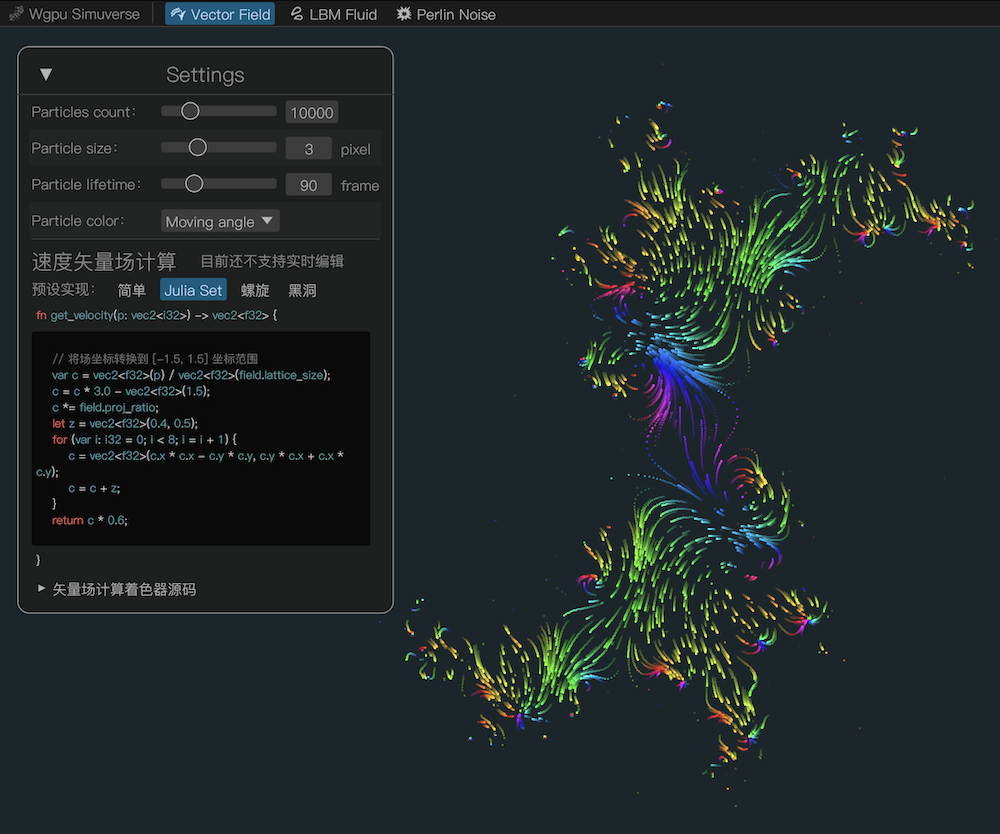
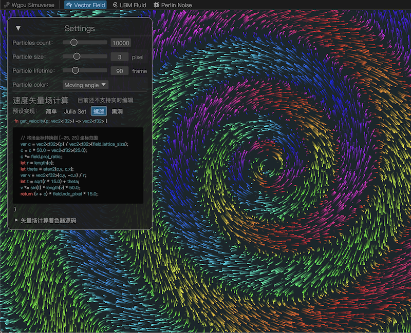
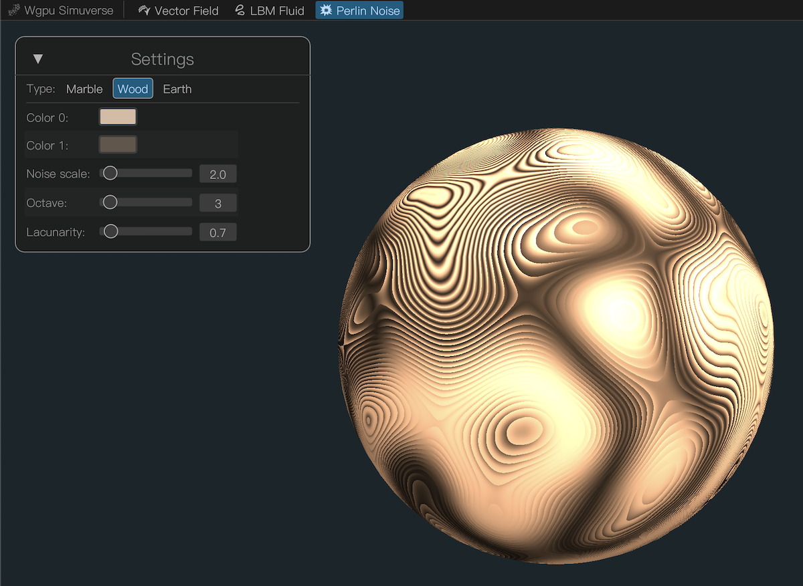
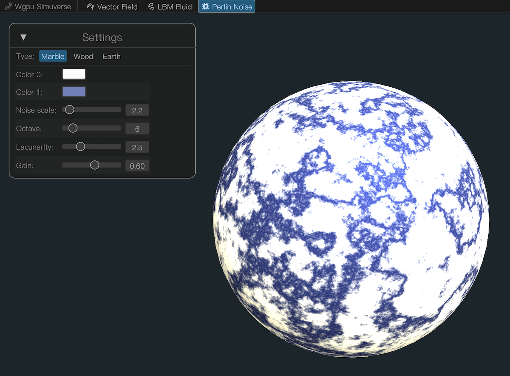
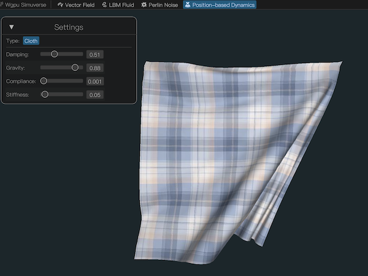
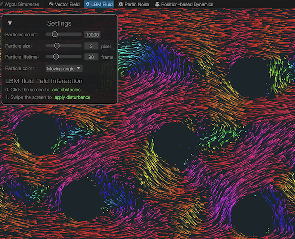
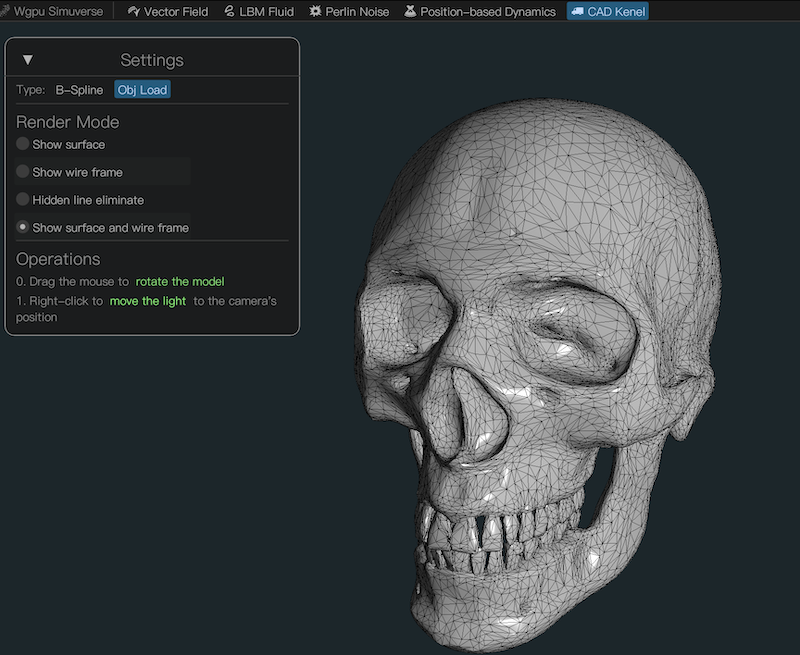
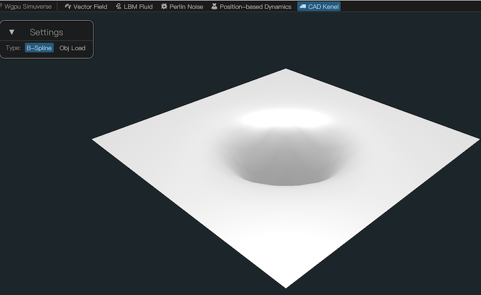

# Simuverse


[](https://github.com/jinleili/simuverse/actions)
[](https://github.com/jinleili/simuverse#license)

Simulate particle vector fields, fluid dynamics, procedural textures, and position-based dynamics based on [wgpu](https://github.com/gfx-rs/wgpu) + [egui](https://github.com/emilk/egui).

It is not only a complete example but also an extension of the [学习 wgpu](https://github.com/jinleili/learn-wgpu-zh).

**[Online Demo](https://jinleili.github.io/learn-wgpu-zh/simuverse)**

## Screenshot

|                                         |                                            |
| --------------------------------------- | ------------------------------------------ |
|  |             |
|            |           |
|      |           |
|        |  |

## Running

**On native**:

```sh
cargo run
```

**On web browser**:
_Need Chrome 113+ or [Chrome Canary](https://jinleili.github.io/learn-wgpu-zh/#如何开启浏览器-webgpu-试验功能)_

```sh
cargo run-wasm
```

## License

Licensed under the [MIT License](https://github.com/jinleili/simuverse/blob/main/LICENSE.MIT).
